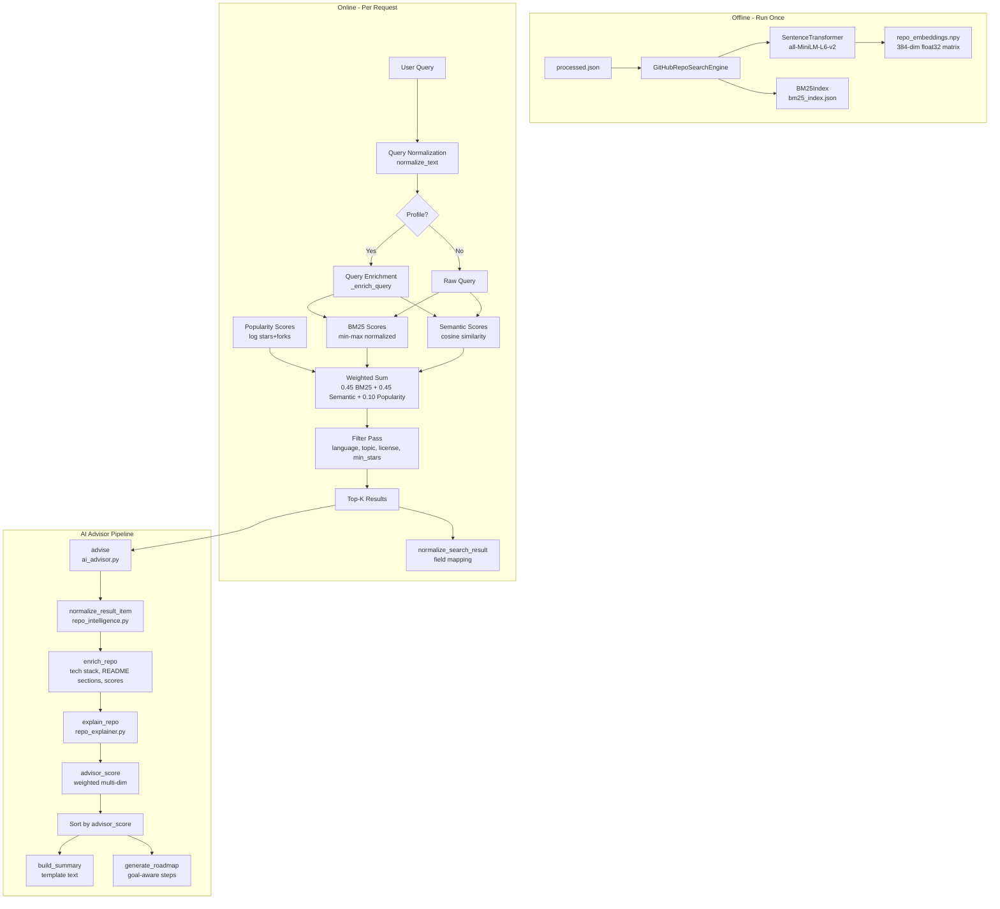

# RepoMind AI — AI Pipeline

## Overview

RepoMind AI uses a **fully template/rule-based AI pipeline** — no LLM, no external AI API, no hallucination risk. All AI features are grounded in repository metadata and README content.

The pipeline has two phases:
1. **Offline** — Embedding generation (runs once, cached)
2. **Online** — Per-request scoring, enrichment, explanation, roadmap generation

---

## AI Pipeline Architecture



---

## Stage 1 — Embeddings

**File:** `core/search_engine.py` → `GitHubRepoSearchEngine._load_or_build_embeddings()`

**Model:** `sentence-transformers/all-MiniLM-L6-v2`
- Dimensions: 384
- Normalized: Yes (`normalize_embeddings=True`)
- Stored as: `storage/repo_embeddings.npy` (float32)

**Input text per repo (`_repo_text()`):**
```
Repository: {full_name}
Title: {title}
Description: {description}
Language: {language}
Topics: {topics joined}
License: {license}
README: {readme[:4000]}
Tokens: {processed_tokens[:2500]}
```

**Caching:** SHA-256 fingerprint of dataset → skip rebuild if fingerprint matches.

**Batch size:** 32 repos per encode call.

---

## Stage 2 — BM25 Index

**File:** `core/search_engine.py` → `BM25Index`

**Algorithm:** BM25 (Okapi BM25) — pure Python implementation.
- k1 = 1.5
- b = 0.75
- IDF formula: `log(1 + (N - df + 0.5) / (df + 0.5))`

**Stored as:** `storage/bm25_index.json` (~4.5 MB)

**Tokenization:** `tokenize()` function — regex word extraction, lowercase, strip punctuation, remove default stopwords (`a`, `an`, `the`, `github`, `repo`, etc.).

---

## Stage 3 — Hybrid Search Scoring

**File:** `core/search_engine.py` → `GitHubRepoSearchEngine.search()`

**Scoring formula:**
```
final_score = 0.45 × BM25_normalized + 0.45 × Semantic_cosine_normalized + 0.10 × Popularity_normalized
```

**BM25 scores:** Raw BM25 scores → min-max normalized to [0, 1]

**Semantic scores:** Cosine similarity between query embedding and repo embeddings → shifted from [-1, 1] to [0, 1] via `(cosine + 1) / 2`

**Popularity scores:** `log1p(stars) + 0.35 × log1p(forks)` → min-max normalized

**Weak match filter:** Results where `bm25 ≤ 0 AND semantic < 0.52` are excluded (prevents irrelevant semantic-only matches).

---

## Stage 4 — Profile-Based Query Enrichment

**File:** `backend/core/semantic_loader.py` → `_enrich_query()`

**File:** `smart_profile_recommender_v2.py` → `UserProfile.to_profile_query()`

When a user profile is provided:
1. `expand_topics_from_project_type()` — maps `project_type` to topic keywords
2. `to_profile_query()` — concatenates: `{language} {topics} {goal} {level} {repo_kind} {complexity}`
3. Enriched query = `"{original_query} {profile_query}"`

Example: `"image processing"` + profile `{language: Python, project_type: ai_ml, goal: learning}` → `"image processing python machine-learning ai deep-learning learning"`

---

## Stage 5 — Profile Recommendation (No Query)

**File:** `smart_profile_recommender_v2.py` → `SmartProfileRecommender.recommend_for_profile()`

Multi-dimensional scoring without a search query:

| Score Component | Weight | Method |
|---|---|---|
| Project Type | 25% | Topic intersection between profile topics and repo doc terms |
| Language | 20% | Exact match → 1.0, secondary language → 0.7 |
| Goal | 20% | Signal keyword matching against doc terms and text blob |
| Level | 15% | Signal keyword matching |
| Repo Kind | 10% | Signal keyword matching |
| Complexity | 5% | README length + topic count + language count heuristic |
| Profile Keyword | 5% | BM25-like keyword coverage |

---

## Stage 6 — Repository Enrichment

**File:** `backend/core/repo_intelligence.py` → `enrich_repo()`

Every repository going through the Advisor pipeline is enriched with computed features:

| Feature | Method |
|---|---|
| `tech_stack` | Regex keyword matching against 30+ technology aliases in combined text |
| `readme_sections` | Heading-based section detection (installation, usage, examples, contributing, license, api, testing, deployment, security) |
| `documentation_score` | Weighted sum of README length + present sections |
| `contribution_score` | Contribution keyword matching + contributing section presence + open issues count |
| `health_score` | Composite: 25% documentation + 10% contribution + 20% stars + 10% forks + 20% activity + 15% quality |
| `difficulty` | Heuristic: beginner/advanced keyword ratios + tech stack count |
| `repo_intents` | Keyword scoring for: learning, contribution, production, research, tool_usage, portfolio |

---

## Stage 7 — Repository Explanation

**File:** `backend/core/repo_explainer.py` → `explain_repo()`

Generates a structured per-repo explanation:

| Output Field | Source |
|---|---|
| `summary` | Template: `"{name} is a {language} repo related to {topics}. Description: {desc}. Technologies: {tech_stack}"` |
| `best_for` | Intent + profile goal matching (learning / contribution / production / research / tool / portfolio) |
| `difficulty` | From `enrich_repo()` |
| `strengths` | Up to 6 positive signals from scores, sections, query matches |
| `weaknesses` | Up to 5 negative signals from low scores and missing sections |
| `why_recommended` | Combined: query match, BM25/semantic scores, profile language match, goal-intent match |
| `roadmap` | From `roadmap_generator.generate_roadmap()` |

---

## Stage 8 — Deep Project Explanation

**File:** `backend/core/project_explainer.py` → `explain_project()`

More detailed than `repo_explainer.py`, adds:

| Output Field | Source |
|---|---|
| `readme_preview` | First 700 chars of cleaned README (markdown stripped) |
| `section_snippets` | Actual text content extracted from each README section heading |
| `how_to_use_it` | Step-by-step usage guide derived from detected sections |
| `contribution_guidance` | Contribution steps derived from contributing section + score |
| `scores_interpretation` | Label ("Strong"/"Medium"/"Limited"/"Weak") for each score |
| `metrics` | All raw numeric metrics including `contributors_count`, `open_issues`, `watchers` |

---

## Stage 9 — Roadmap Generation

**File:** `backend/core/roadmap_generator.py` → `generate_roadmap()`

Goal-aware routing:

| User Goal Contains | Roadmap Type | Steps |
|---|---|---|
| "learn" or "education" | `learning` | README → install → run example → study structure → modify → compare |
| "contribut" or "open-source" | `contribution` | README → install → contributing guide → find issues → run tests → open PR |
| "production" or "use" or "tool" | `production` | README → install → check license/health → review tests → deploy instructions → prototype |
| "portfolio" or "project" | `portfolio` | README → fork → customize → document → deploy → case study |
| (fallback by intent) | `general` | README → install → run → explore → try change |

All roadmaps start with `_common_start()` which detects installation/usage/example sections.

---

## Stage 10 — AI Advisor Multi-Repo Summary

**File:** `backend/core/ai_advisor.py` → `advise()`

For the top-K search results:

1. Each result is normalized via `normalize_result_item()` → `enrich_repo()`
2. Each repo is explained via `explain_repo()`
3. An `_advisor_score()` is computed:
   ```
   score = 0.35 × final_search_score
         + 0.15 × semantic_score
         + 0.10 × profile_score
         + 0.15 × documentation_score
         + 0.15 × health_score
         + [goal-specific bonus: learning/contribution/production intent]
   ```
4. Results are sorted by `advisor_score`
5. Best repo is selected; roadmap is generated for it
6. `build_summary()` produces a natural language advisory paragraph

---

## AI Pipeline Summary Table

| Stage | File | LLM? | Output |
|---|---|---|---|
| Embeddings | `core/search_engine.py` | No (ST model) | `repo_embeddings.npy` |
| BM25 Index | `core/search_engine.py` | No | `bm25_index.json` |
| Hybrid Search | `core/search_engine.py` | No | Ranked result list |
| Query Enrichment | `smart_profile_recommender_v2.py` | No | Expanded query string |
| Profile Recommend | `smart_profile_recommender_v2.py` | No | Profile-matched repos |
| Repo Enrichment | `backend/core/repo_intelligence.py` | No | Enriched repo dict |
| Repo Explanation | `backend/core/repo_explainer.py` | No | Structured explanation |
| Project Explainer | `backend/core/project_explainer.py` | No | Deep README analysis |
| Roadmap | `backend/core/roadmap_generator.py` | No | Ordered step list |
| Advisor Summary | `backend/core/ai_advisor.py` | No | Advisory paragraph |

> **Design Decision:** All AI is intentionally template/rule-based. The codebase contains a `core/rag_advisor.py` stub that was planned for LLM/RAG integration but is currently unused. The system is designed to be upgradeable to a RAG architecture without changing the API contract.
