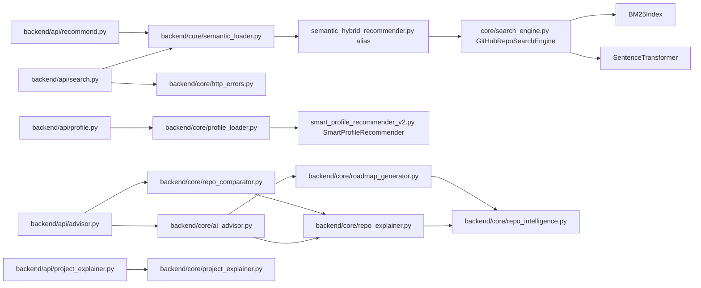

# RepoMind AI — Architecture

## Overview

RepoMind AI is a layered system divided into:

1. **Data Pipeline** — scraping, processing, analysis (offline, run once)
2. **Search Indexing** — BM25 + semantic embeddings (lazy-built, cached)
3. **FastAPI Backend** — 6 API routers serving all features
4. **React Frontend** — single-page app talking to the backend over HTTP

---

## Full Architecture Diagram

```mermaid
graph TD
    subgraph Data Pipeline
        A[scraper.py<br>GitHub API + HTML] -->|new_data.json| B[process.py<br>NLP Processing]
        B -->|processed.json| C[analysis.py<br>Stats Report]
        B -->|processed.json| D[quadrant_updater.py<br>Optional Qdrant Upload]
    end

    subgraph Search Index Layer
        B -->|processed.json| E[GitHubRepoSearchEngine<br>core/search_engine.py]
        E --> F[BM25Index<br>storage/bm25_index.json]
        E --> G[SentenceTransformer<br>all-MiniLM-L6-v2]
        G --> H[Embeddings<br>storage/repo_embeddings.npy]
        D --> I[(Qdrant<br>:6333)]
    end

    subgraph FastAPI Backend - backend/main.py :8000
        J[/search/] --> K[semantic_loader.py<br>hybrid_search]
        L[/recommend/] --> K
        M[/repos/] --> N[repo_sanitize.py]
        O[/profile/questions<br>/profile/recommend<br>/profile/search] --> P[profile_loader.py<br>SmartProfileRecommender]
        Q[/api/advisor/explain<br>/api/advisor/roadmap<br>/api/advisor/compare<br>/api/advisor/summary] --> R[repo_explainer.py<br>roadmap_generator.py<br>repo_comparator.py<br>ai_advisor.py]
        S[/api/project-explainer/explain] --> T[project_explainer.py]
        K --> E
        P --> U[smart_profile_recommender_v2.py]
        R --> V[repo_intelligence.py]
    end

    subgraph React Frontend - :5173
        W[App.jsx<br>Main Application] --> X[SearchBar.jsx]
        W --> Y[Filters.jsx]
        W --> Z[RepoCard.jsx]
        W --> AA[ProfileWizard.jsx]
        W --> AB[ProjectExplainButton.jsx]
        W --> AC[RecommendationPanel.jsx]
        W --> AD[AdvisorSummaryPanel.jsx]
        W --> AE[RoadmapPanel.jsx]
        X --> J
        AA --> O
        AB --> S
        AC --> L
        AD --> Q
    end
```

---

## Component Relationships

### Frontend → Backend

| Frontend Component | Backend Endpoint | Description |
|---|---|---|
| `SearchBar.jsx` | `POST /search/` | Main hybrid search |
| `Filters.jsx` | `GET /repos/filters/options` | Populate filter dropdowns |
| `ProfileWizard.jsx` | `GET /profile/questions` | Fetch profile wizard questions |
| `ProfileWizard.jsx` | `POST /profile/recommend` | Submit profile for recommendations |
| `RepoCard.jsx` | `POST /api/advisor/explain` | "Explain this repo" |
| `ProjectExplainButton.jsx` | `POST /api/project-explainer/explain` | Deep project analysis |
| `RecommendationPanel.jsx` | `POST /recommend/` | Similar repos |
| `AdvisorSummaryPanel.jsx` | `POST /api/advisor/summary` | AI advisor text |
| `RoadmapPanel.jsx` | `POST /api/advisor/roadmap` | Generate roadmap |
| `RepoCompareModal.jsx` | `POST /api/advisor/compare` | Compare two repos |

### Backend → Core Engine



---

## Data Flow Description

### Search Flow
```
User types query
→ POST /search/ {query, filters, profile}
→ semantic_loader.hybrid_search()
→ Profile query enrichment (optional)
→ GitHubRepoSearchEngine.search()
  → BM25 scores (lexical)
  → Semantic cosine scores (embedding)
  → Popularity scores (log stars+forks)
  → Weighted combination + filter pass
→ normalize_search_result()
→ Return ranked list to frontend
```

### Profile Recommendation Flow
```
User completes ProfileWizard
→ GET /profile/questions → returns question options from smart_profile_options.json
→ POST /profile/recommend {project_type, language, goal, level, repo_kind, complexity}
→ SmartProfileRecommender.recommend_for_profile()
  → project_type_score (topic matching)
  → language_score
  → signal_score (goal, level, repo_kind)
  → complexity_score (README length, topic count)
  → Weighted combination
→ Return sorted results
```

### AI Advisor Flow
```
User clicks "Get AI Advice" after search
→ POST /api/advisor/summary {query, profile, results[top5]}
→ ai_advisor.advise()
  → For each result: normalize_result_item() → explain_repo() → _advisor_score()
  → Sort by advisor_score
  → build_summary() → generate_roadmap() for best repo
→ Return: summary text, recommended repo, top explanations, roadmap
```

### Repo Explainer Flow
```
User clicks "Explain this repo"
→ POST /api/project-explainer/explain {repo, profile, query}
→ project_explainer.explain_project()
  → normalize_repo() (multi-format normalization)
  → extract_readme_sections() (heading detection)
  → extract_section_snippets() (snippet extraction)
  → extract_tech_stack() (tech keyword matching)
  → calculate_documentation_score()
  → calculate_contribution_score()
  → calculate_health_score()
  → infer_difficulty()
  → infer_repo_intents()
→ Return structured explanation with all sections
```

---

## Key Design Decisions

| Decision | Rationale |
|---|---|
| No LLM in production | All AI features are template/rule-based; no hallucinations, no API cost, instant response |
| Dual index location | `storage/` (used by backend) and `vector_db/` (alternative) — indexes are rebuilt lazily |
| Singleton pattern for engines | `_hybrid` and `_recommender` globals in loaders prevent re-loading models per request |
| Qdrant optional | The main search engine uses local `.npy` + `.json` indexes; Qdrant is an optional upgrade path |
| `repo_utils.py` at root | Imported by both `backend/core/` modules and data pipeline scripts; placed at root to avoid package boundary issues |
| `semantic_hybrid_recommender.py` alias | `SemanticHybridRecommender = GitHubRepoSearchEngine` at end of `core/search_engine.py` for backwards compatibility |
