# RepoMind AI — Dependency Graph

## Internal Module Dependency Map

```mermaid
graph TD
    subgraph "Data Pipeline (Root)"
        scraper[scraper.py]
        process[process.py]
        analysis[analysis.py]
        repo_utils_root[repo_utils.py]
        smart_profile[smart_profile_recommender_v2.py]
        semantic_hybrid_alias[semantic_hybrid_recommender.py\nAlias file]
    end

    subgraph "Core Search Engine"
        search_engine[core/search_engine.py\nGitHubRepoSearchEngine\nBM25Index]
    end

    subgraph "Backend Entry"
        main[backend/main.py]
    end

    subgraph "Backend API Layer"
        api_search[backend/api/search.py]
        api_recommend[backend/api/recommend.py]
        api_repos[backend/api/repos.py]
        api_profile[backend/api/profile.py]
        api_advisor[backend/api/advisor.py]
        api_project[backend/api/project_explainer.py]
    end

    subgraph "Backend Core Layer"
        semantic_loader[backend/core/semantic_loader.py]
        profile_loader[backend/core/profile_loader.py]
        repo_intelligence[backend/core/repo_intelligence.py]
        repo_explainer[backend/core/repo_explainer.py]
        project_explainer[backend/core/project_explainer.py]
        roadmap_generator[backend/core/roadmap_generator.py]
        ai_advisor[backend/core/ai_advisor.py]
        repo_comparator[backend/core/repo_comparator.py]
        http_errors[backend/core/http_errors.py]
        repo_sanitize[backend/core/repo_sanitize.py]
    end

    subgraph "Backend Schemas"
        schema_search[backend/schemas/search_schema.py]
        schema_advisor[backend/schemas/advisor.py]
        schema_profile[backend/schemas/profile_schema.py]
        schema_project[backend/schemas/project_explainer.py]
        schema_validators[backend/schemas/validators.py]
    end

    subgraph "Frontend"
        frontend_client[frontend/src/api/client.js]
        app_jsx[frontend/src/App.jsx]
    end

    %% Main registrations
    main --> api_search
    main --> api_recommend
    main --> api_repos
    main --> api_profile
    main --> api_advisor
    main --> api_project

    %% API → Core
    api_search --> semantic_loader
    api_search --> http_errors
    api_search --> schema_search
    api_recommend --> semantic_loader
    api_recommend --> http_errors
    api_recommend --> schema_search
    api_repos --> semantic_loader
    api_repos --> repo_sanitize
    api_repos --> http_errors
    api_repos --> repo_utils_root
    api_profile --> profile_loader
    api_profile --> http_errors
    api_profile --> schema_profile
    api_advisor --> ai_advisor
    api_advisor --> repo_explainer
    api_advisor --> roadmap_generator
    api_advisor --> repo_comparator
    api_advisor --> http_errors
    api_advisor --> schema_advisor
    api_project --> project_explainer
    api_project --> http_errors
    api_project --> schema_project

    %% Schema dependencies
    schema_advisor --> schema_validators

    %% Semantic loader dependencies
    semantic_loader --> search_engine
    semantic_loader --> repo_utils_root
    semantic_loader --> smart_profile

    %% Profile loader dependencies
    profile_loader --> smart_profile
    profile_loader --> repo_utils_root

    %% Core layer dependencies
    repo_explainer --> repo_intelligence
    repo_explainer --> roadmap_generator
    ai_advisor --> repo_intelligence
    ai_advisor --> repo_explainer
    ai_advisor --> roadmap_generator
    repo_comparator --> repo_intelligence
    repo_comparator --> repo_explainer
    roadmap_generator --> repo_intelligence

    %% Root-level aliases
    semantic_hybrid_alias --> search_engine

    %% Frontend
    app_jsx --> frontend_client
```



---

## Textual Dependency List

### `backend/main.py`
- **Imports:** `backend/api/search`, `backend/api/recommend`, `backend/api/repos`, `backend/api/profile`, `backend/api/advisor`, `backend/api/project_explainer`
- **Used by:** `uvicorn` (process entry point)

---

### `backend/api/search.py`
- **Imports:** `backend/core/semantic_loader`, `backend/core/http_errors`, `backend/schemas/search_schema`
- **Used by:** `backend/main.py`

### `backend/api/recommend.py`
- **Imports:** `backend/core/semantic_loader`, `backend/core/http_errors`, `backend/schemas/search_schema`
- **Used by:** `backend/main.py`

### `backend/api/repos.py`
- **Imports:** `backend/core/semantic_loader`, `backend/core/repo_sanitize`, `backend/core/http_errors`, `repo_utils` (root)
- **Used by:** `backend/main.py`

### `backend/api/profile.py`
- **Imports:** `backend/core/profile_loader`, `backend/core/http_errors`, `backend/schemas/profile_schema`
- **Used by:** `backend/main.py`

### `backend/api/advisor.py`
- **Imports:** `backend/core/ai_advisor`, `backend/core/repo_explainer`, `backend/core/roadmap_generator`, `backend/core/repo_comparator`, `backend/core/http_errors`, `backend/schemas/advisor`
- **Used by:** `backend/main.py`

### `backend/api/project_explainer.py`
- **Imports:** `backend/core/project_explainer`, `backend/core/http_errors`, `backend/schemas/project_explainer`
- **Used by:** `backend/main.py`

---

### `backend/core/semantic_loader.py`
- **Imports:** `repo_utils` (root), `semantic_hybrid_recommender` (root alias), `smart_profile_recommender_v2` (root)
- **Used by:** `backend/api/search`, `backend/api/recommend`, `backend/api/repos`

### `backend/core/profile_loader.py`
- **Imports:** `repo_utils` (root), `smart_profile_recommender_v2` (root)
- **Used by:** `backend/api/profile`

### `backend/core/repo_intelligence.py`
- **Imports:** `re`, `math`, `datetime` (stdlib only)
- **Used by:** `backend/core/repo_explainer`, `backend/core/roadmap_generator`, `backend/core/ai_advisor`, `backend/core/repo_comparator`

### `backend/core/repo_explainer.py`
- **Imports:** `backend/core/repo_intelligence`, `backend/core/roadmap_generator`
- **Used by:** `backend/api/advisor`, `backend/core/ai_advisor`, `backend/core/repo_comparator`

### `backend/core/roadmap_generator.py`
- **Imports:** `backend/core/repo_intelligence`
- **Used by:** `backend/api/advisor`, `backend/core/ai_advisor`, `backend/core/repo_explainer`

### `backend/core/ai_advisor.py`
- **Imports:** `backend/core/repo_intelligence`, `backend/core/repo_explainer`, `backend/core/roadmap_generator`
- **Used by:** `backend/api/advisor`

### `backend/core/repo_comparator.py`
- **Imports:** `backend/core/repo_intelligence`, `backend/core/repo_explainer`
- **Used by:** `backend/api/advisor`

### `backend/core/project_explainer.py`
- **Imports:** `re`, `datetime` (stdlib only) — **fully self-contained**
- **Used by:** `backend/api/project_explainer`

---

### `repo_utils.py` (Root)
- **Imports:** `re` (stdlib only)
- **Used by:** `backend/core/semantic_loader`, `backend/core/profile_loader`, `backend/api/repos`

### `smart_profile_recommender_v2.py` (Root)
- **Imports:** `json`, `math`, `re`, `collections`, `dataclasses` (stdlib only)
- **Used by:** `backend/core/semantic_loader`, `backend/core/profile_loader`

### `semantic_hybrid_recommender.py` (Root)
- **Imports:** `core/search_engine` (via `from core.search_engine import ...`)
- **Used by:** `backend/core/semantic_loader`

### `core/search_engine.py`
- **Imports:** `numpy`, `sentence_transformers`, `json`, `math`, `hashlib`, `re` (stdlib + numpy + ST)
- **Used by:** `semantic_hybrid_recommender.py` (alias)

---

### `scraper.py`
- **Imports:** `requests`, `beautifulsoup4`, `python-dotenv`, `json`, `os`, `base64`, `concurrent.futures`
- **Used by:** Manual execution only

### `process.py`
- **Imports:** `nltk`, `json`, `re`, `math`, `datetime`
- **Used by:** Manual execution only

### `analysis.py`
- **Imports:** `json`, `collections.Counter`
- **Used by:** Manual execution only

---

## Circular Dependency Analysis

**No circular dependencies were found.**

The dependency graph flows strictly in one direction:

```
Frontend → API Layer → Core Layer → Root Modules → Stdlib/Third-party
```

The only potential concern is the import of root-level modules (`repo_utils.py`, `smart_profile_recommender_v2.py`) from within the `backend/core/` package. These imports work correctly because Python resolves them relative to the working directory (project root), which is where `uvicorn` is launched from.

---

## External Dependencies

| Package | Version | Used By |
|---|---|---|
| `fastapi` | ≥0.115 | `backend/main.py`, all API routes |
| `uvicorn[standard]` | ≥0.30 | Process runner |
| `pydantic` | ≥2.7 | All schemas |
| `numpy` | ≥2.0 | `core/search_engine.py` |
| `sentence-transformers` | ≥3.0 | `core/search_engine.py`, `quadrant_updater.py` |
| `nltk` | ≥3.9 | `process.py` |
| `requests` | ≥2.32 | `scraper.py` |
| `beautifulsoup4` | ≥4.12 | `scraper.py` |
| `python-dotenv` | ≥1.0 | `scraper.py`, `quadrant_updater.py` |
| `qdrant-client` | ≥1.9 | `quadrant_updater.py` (optional) |

### Frontend
| Package | Version | Used By |
|---|---|---|
| `react` | ^19 | All components |
| `react-dom` | ^19 | `main.jsx` |
| `axios` | ^1.18 | `src/api/client.js` |
| `lucide-react` | ^1.21 | UI icons in components |
| `vite` | ^8 | Build tool |
| `@vitejs/plugin-react` | ^6 | Vite React plugin |
