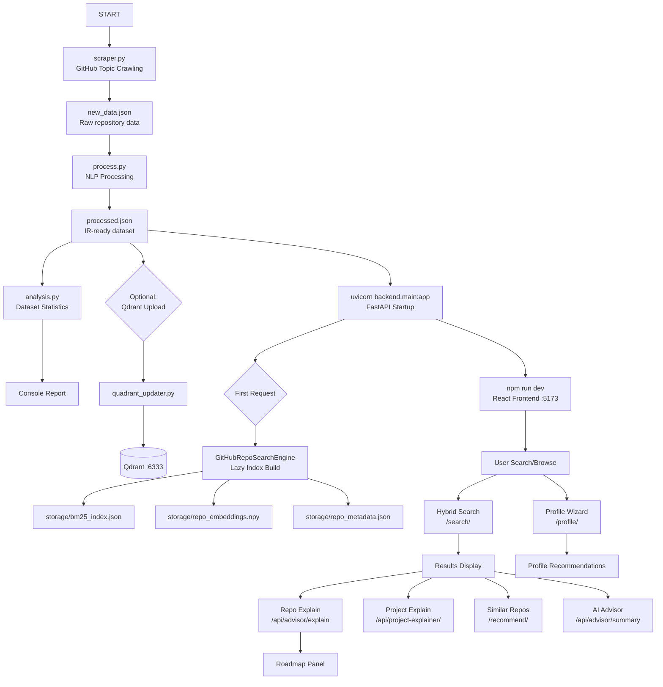

# RepoMind AI — Execution Pipeline

## Pipeline Overview



---

## Step-by-Step Pipeline

---

### Step 1 — GitHub Repository Scraping

**Script:** `scraper.py`
**Class:** `FastGitHubScraper`

| Field | Value |
|---|---|
| **Input** | GitHub website (HTML) + GitHub REST API |
| **Output** | `new_data.json` |
| **Required Files** | `.env` (optional, for `GITHUB_TOKEN`) |
| **Generated Files** | `new_data.json`, `cache.json` (HTTP cache) |
| **Dependencies** | `requests`, `beautifulsoup4`, `python-dotenv` |

**Process:**
1. `get_topics()` — crawls `github.com/topics` to collect topic slugs (up to 50)
2. `crawl_topic_repos()` — for each topic, crawls pages 1–5 and collects `owner/repo` URLs (up to 2000 total)
3. `scrape_repo()` — for each URL, calls GitHub API `/repos/{owner}/{repo}` and `/repos/{owner}/{repo}/readme`
4. ThreadPoolExecutor (12 workers) runs scraping in parallel
5. Auto-saves every 20 repos; final save to `new_data.json`

**Output Schema per record:**
```json
{
  "url": "https://github.com/owner/repo",
  "name": "repo",
  "full_name": "owner/repo",
  "description": "...",
  "stars": 1234,
  "forks": 56,
  "language": "Python",
  "topics": ["machine-learning", "python"],
  "created_at": "2020-01-01T00:00:00Z",
  "updated_at": "2024-06-01T00:00:00Z",
  "readme": "# README content...",
  "readme_length": 5000
}
```

---

### Step 2 — Data Processing (NLP Pipeline)

**Script:** `process.py`
**Entry function:** `process_data(input_file="new_data.json", output_file="processed.json")`

| Field | Value |
|---|---|
| **Input** | `new_data.json` |
| **Output** | `processed.json` |
| **Required Files** | `new_data.json` |
| **Generated Files** | `processed.json` |
| **Dependencies** | `nltk` (stopwords, wordnet, omw-1.4), `json`, `re`, `math` |

**Process:**
1. `normalize_item()` — standardizes numeric fields (`stars`, `forks`, `watchers`, `issues`)
2. `clean_text()` — lowercases, removes URLs, preserves programming symbols (`c++`, `c#`), removes stopwords, lemmatizes
3. Field-weighted token construction:
   - `title_tokens × 5` + `desc_tokens × 3` + `meta_tokens × 3` + `readme_tokens × 1` + `pop_tokens`
4. `compute_popularity_score()` — `0.6×log(stars) + 0.3×log(forks) + 0.1×log(watchers)`
5. `compute_activity_score()` — time-based decay score (1.0 for < 30 days, down to 0.1 for > 2 years)
6. `compute_quality_score()` — presence of description, readme, license, topics, language
7. `popularity_tokens()` — adds synthetic tokens (`extremely_popular`, `very_popular`, etc.) as IR boosts

**Output adds to each record:**
```json
{
  "tokens": ["machine", "learning", "python", ...],
  "title_tokens": [...],
  "desc_tokens": [...],
  "readme_tokens": [...],
  "meta_tokens": [...],
  "pop_tokens": ["popular", "popular", "popular"],
  "doc_length": 320,
  "popularity_score": 4.21,
  "activity_score": 0.8,
  "quality_score": 0.9,
  "processed_text": "machine learning python ..."
}
```

---

### Step 3 — Dataset Analysis

**Script:** `analysis.py`
**Entry function:** `run_analysis()`

| Field | Value |
|---|---|
| **Input** | `processed.json` |
| **Output** | Console printed report |
| **Required Files** | `processed.json` |
| **Generated Files** | None |
| **Dependencies** | `json`, `collections.Counter` |

**Report includes:**
- Total document count, avg document length, vocab size, vocab density
- Top 10 IR signal terms (most frequent tokens)
- Top 8 programming languages (with ASCII bar chart)
- Top 8 topics (with ASCII bar chart)
- Average stars and forks
- Top 5 starred and top 5 forked repositories

---

### Step 4 — Search Index Building (Lazy, On First Request)

**Script:** `core/search_engine.py` → `GitHubRepoSearchEngine`
**Triggered by:** First call to `load_semantic_hybrid()` in `backend/core/semantic_loader.py`

| Field | Value |
|---|---|
| **Input** | `processed.json` |
| **Output** | `storage/bm25_index.json`, `storage/repo_embeddings.npy`, `storage/repo_metadata.json` |
| **Required Files** | `processed.json` |
| **Generated Files** | `storage/bm25_index.json`, `storage/repo_embeddings.npy`, `storage/repo_metadata.json` |
| **Dependencies** | `sentence-transformers`, `numpy` |

**Process:**
1. Loads all documents from `processed.json`; filters to real GitHub repos (`is_github_repository()`)
2. Computes dataset fingerprint (SHA-256 of key fields)
3. Checks if `storage/repo_metadata.json` fingerprint matches → skip rebuild if cached
4. `BM25Index.build()` — tokenizes all repo texts, computes TF-IDF/IDF, saves to `bm25_index.json`
5. `model.encode()` — encodes all repo texts with `all-MiniLM-L6-v2`, saves to `repo_embeddings.npy`
6. Saves metadata fingerprint

**Cache invalidation:** If `processed.json` changes (different fingerprint), indexes are rebuilt automatically.

---

### Step 5 (Optional) — Qdrant Vector Database Upload

**Script:** `quadrant_updater.py`
**Entry function:** `sync_processed_json_to_qdrant()`

| Field | Value |
|---|---|
| **Input** | `processed.json` |
| **Output** | Qdrant collection `github_repos` |
| **Required Files** | `processed.json`, running Qdrant instance (`:6333`) |
| **Generated Files** | None (data stored in Qdrant) |
| **Dependencies** | `qdrant-client`, `sentence-transformers` |

**Note:** The main backend does NOT use Qdrant. This step is optional for future Qdrant-backed search.

---

### Step 6 — FastAPI Backend Startup

**Script:** `backend/main.py`
**Command:** `uvicorn backend.main:app --reload --port 8000`

| Field | Value |
|---|---|
| **Input** | N/A (starts server) |
| **Output** | HTTP API on `:8000` |
| **Required Files** | `processed.json`, `storage/` (auto-built on first request), `smart_profile_options.json` |
| **Generated Files** | `storage/bm25_index.json`, `storage/repo_embeddings.npy`, `storage/repo_metadata.json` (lazy) |
| **Dependencies** | `fastapi`, `uvicorn`, `pydantic`, `sentence-transformers`, `numpy` |

**Startup sequence:**
1. FastAPI app is created with CORS configuration
2. 6 routers are registered
3. Server starts listening; **no models are loaded yet**
4. On first `/search/` or `/recommend/` request → `load_semantic_hybrid()` → `GitHubRepoSearchEngine` loads + builds index

---

### Step 7 — Frontend Startup

**Directory:** `frontend/`
**Command:** `npm run dev`

| Field | Value |
|---|---|
| **Input** | N/A |
| **Output** | React dev server on `:5173` |
| **Required Files** | `frontend/node_modules/` (run `npm install` first) |
| **Generated Files** | None |
| **Dependencies** | Node.js, npm, Vite |

**Configuration:**
- Vite proxy: all `/api` requests → `http://127.0.0.1:8000` (strips `/api` prefix)
- `VITE_API_URL` can be set in `.env.local` to override

---

### Step 8 — Search Request Flow

**Endpoint:** `POST /search/`

| Field | Value |
|---|---|
| **Input** | `{query, top_k, language, min_stars, topic, license_name, profile}` |
| **Output** | `{query, count, engine, results[]}` |
| **Files involved** | `backend/api/search.py`, `backend/core/semantic_loader.py`, `core/search_engine.py` |
| **Dependencies** | BM25 index, embedding model, embeddings matrix |

**Scoring formula:**
```
final = 0.45 × BM25(query, repo) + 0.45 × cosine(query_embedding, repo_embedding) + 0.10 × popularity(stars, forks)
```

---

### Step 9 — Profile Recommendation Flow

**Endpoint:** `POST /profile/recommend`

| Field | Value |
|---|---|
| **Input** | `{project_type, language, goal, level, repo_kind, complexity, top_k}` |
| **Output** | `{count, engine, profile, results[]}` |
| **Files involved** | `backend/api/profile.py`, `backend/core/profile_loader.py`, `smart_profile_recommender_v2.py` |
| **Dependencies** | `processed.json` |

**Scoring formula:**
```
score = 0.25×project_type + 0.20×language + 0.20×goal + 0.15×level + 0.10×repo_kind + 0.05×complexity + 0.05×profile_keyword
```

---

### Step 10 — AI Advisor Summary Flow

**Endpoint:** `POST /api/advisor/summary`

| Field | Value |
|---|---|
| **Input** | `{query, profile, results[top5]}` |
| **Output** | `{summary, recommended_repo, roadmap, top_explanations[]}` |
| **Files involved** | `backend/api/advisor.py`, `backend/core/ai_advisor.py`, `backend/core/repo_explainer.py`, `backend/core/repo_intelligence.py`, `backend/core/roadmap_generator.py` |

---

### Step 11 — Project Explainer Flow

**Endpoint:** `POST /api/project-explainer/explain`

| Field | Value |
|---|---|
| **Input** | `{repo: {...}, profile, query}` |
| **Output** | Full structured explanation object |
| **Files involved** | `backend/api/project_explainer.py`, `backend/core/project_explainer.py` |

**Output sections:**
- `repo_identity` (name, url, language, topics, technologies)
- `project_summary` (auto-generated text)
- `best_for` (detected primary use case)
- `difficulty` (beginner/intermediate/advanced)
- `metrics` (stars, forks, documentation_score, health_score, etc.)
- `readme_analysis` (preview, detected sections, section snippets)
- `strengths` and `limitations`
- `how_to_use_it` (step-by-step)
- `contribution_guidance`
- `why_it_matches`
